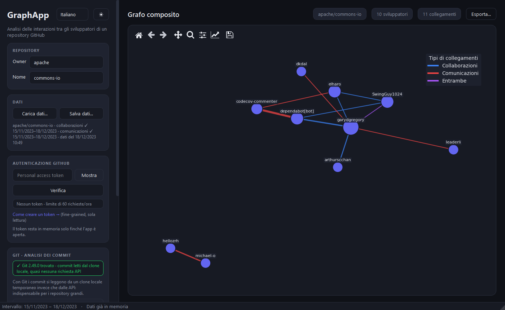
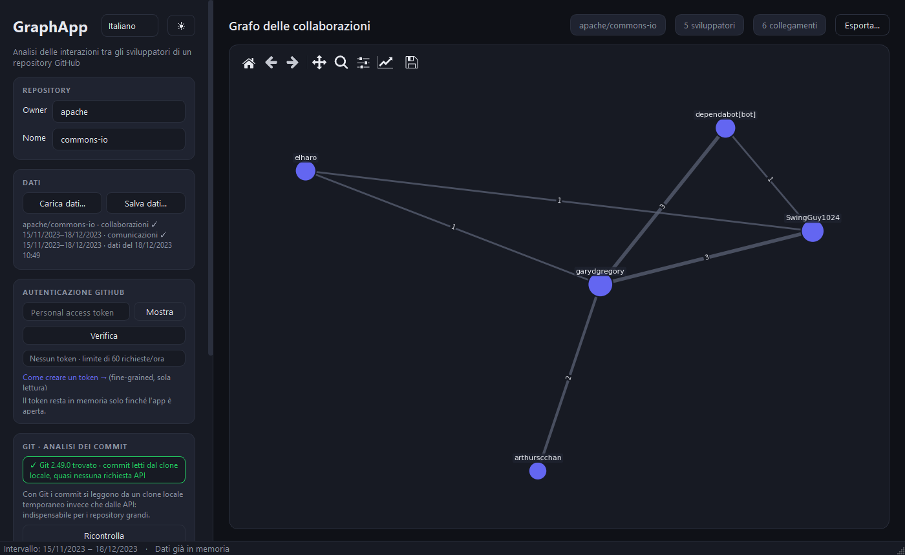
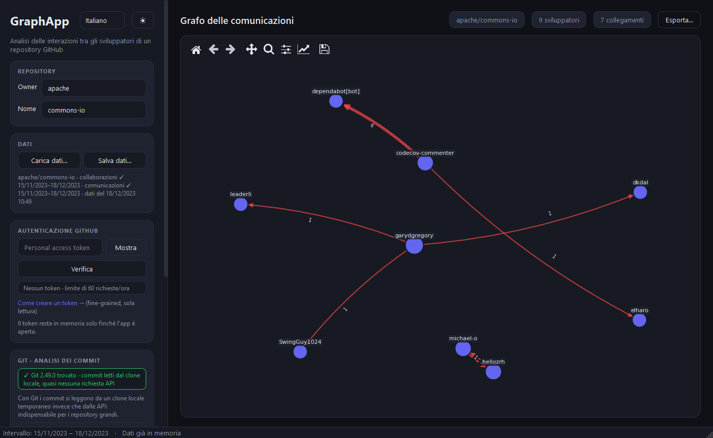
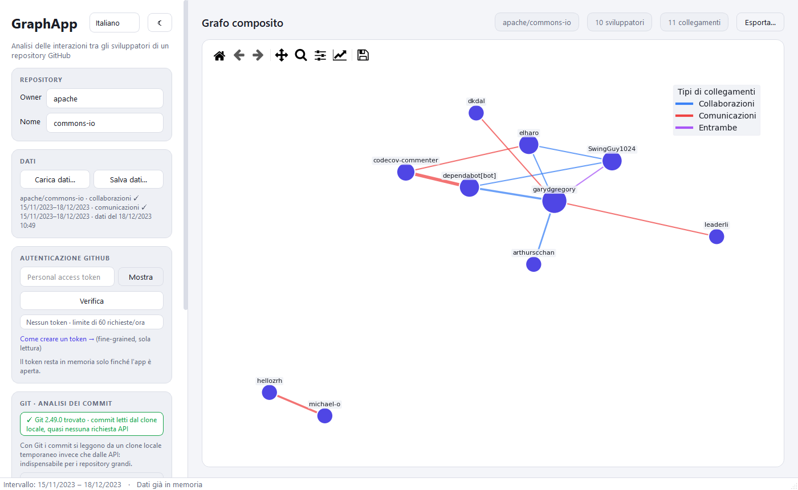
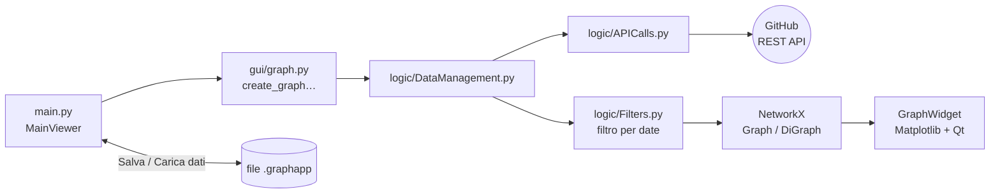

# GraphApp — Collaboration Graph Project

🇬🇧 [English](README.md) · 🇮🇹 **Italiano**

[](https://github.com/gPiscopo3/Ingegneria-del-Software-2023/actions/workflows/python-app.yml)


[](LICENSE)

**GraphApp** è un'applicazione desktop che analizza un repository GitHub e mostra, sotto forma di grafo,
**come collaborano e comunicano i suoi sviluppatori** in un intervallo di tempo scelto dall'utente.

Basta inserire owner e nome del repository: l'app scarica commit, issue, pull request, review e commenti
tramite le API REST di GitHub e costruisce il grafo con
[NetworkX](https://networkx.org/), visualizzandolo con [Matplotlib](https://matplotlib.org/) dentro
un'interfaccia [PyQt6](https://www.riverbankcomputing.com/software/pyqt/).

> Progetto realizzato per il corso di **Ingegneria del Software** (Università degli Studi del Sannio) (A.A. 2023) e successivamente migliorato con l'utilizzo di Claude Code.



---

## Indice

- [Funzionalità](#funzionalità)
- [I tre tipi di grafo](#i-tre-tipi-di-grafo)
- [Screenshot](#screenshot)
- [Scaricare l'app (Windows)](#scaricare-lapp-windows)
- [Installazione da sorgente](#installazione-da-sorgente)
- [Token GitHub](#token-github)
- [Avvio e utilizzo](#avvio-e-utilizzo)
  - [Esportare per l'analisi (R, MATLAB, Python)](#esportare-per-lanalisi-r-matlab-python)
- [Lingue dell'interfaccia](#lingue-dellinterfaccia)
- [Architettura](#architettura)
- [Salvataggio dei dati e rate limit](#salvataggio-dei-dati-e-rate-limit)
  - [Consumo di quota API](#consumo-di-quota-api)
- [Test e qualità del codice](#test-e-qualità-del-codice)
- [Limiti noti](#limiti-noti)
- [Licenza](#licenza)

---

## Funzionalità

- **Tre tipi di grafo**: collaborazioni, comunicazioni e composito (dettagli [qui sotto](#i-tre-tipi-di-grafo)).
- **Filtro temporale**: si sceglie l'intervallo (data di inizio e di fine) da analizzare; cambiandolo,
  il grafo si ricalcola sui dati già scaricati, senza nuove chiamate alle API.
- **Grafo leggibile**: layout force-directed, dimensione dei nodi proporzionale al numero di collegamenti,
  spessore degli archi proporzionale al peso, etichette con il numero di interazioni.
- **Grafi grandi fluidi**: oltre 150 nodi il grafo viene disegnato in modo alleggerito (etichette solo per
  i 40 nodi più collegati, nome di qualsiasi nodo al passaggio del mouse, archi diretti senza frecce oltre
  300 collegamenti), così zoom e spostamento restano immediati anche con migliaia di elementi.
- **Strumenti di esplorazione**: zoom e spostamento dalla toolbar integrata, nome dello sviluppatore al
  passaggio del mouse.
- **Esportazione per l'analisi e per le pubblicazioni**: grafo e dati grezzi in CSV, GraphML e MATLAB
  (.mat), più l'immagine del grafo in PNG (300 dpi), SVG o PDF con sfondo chiaro adatto alla stampa.
- **Interfaccia moderna**: sidebar con i parametri, statistiche del grafo (sviluppatori e collegamenti),
  **tema scuro e chiaro** commutabili al volo.
- **Interfaccia multilingua**: italiano e inglese, scelti in automatico dalla lingua di Windows e
  commutabili al volo; per aggiungere una lingua basta un file di traduzione
  ([dettagli](#lingue-dellinterfaccia)).
- **Token inserito nell'app**: il personal access token si incolla direttamente nell'interfaccia, si
  verifica con un click e resta solo in memoria; la quota di richieste API residua è sempre visibile.
- **Salvataggio e caricamento dei dati**: i dati scaricati da GitHub si salvano in un file `.graphapp`
  scelto dall'utente e si ricaricano in seguito (anche su un altro computer e senza token) per generare
  qualsiasi grafo senza nuove chiamate alle API.
- **Consumo di quota ridotto**: con [Git](https://git-scm.com/downloads) installato i commit si leggono da
  un clone locale temporaneo (nessuna richiesta API per commit); commenti e commenti di review si
  scaricano in blocco per tutto il repository.
- **Download parallelo e in background**: le richieste a GitHub partono su più thread e l'interfaccia
  resta utilizzabile, con l'avanzamento nella barra di stato e un pulsante per annullare.
- **Gestione del rate limit**: in caso di limite raggiunto (primario o secondario) l'app attende il reset
  e riprova automaticamente.

## I tre tipi di grafo

| Tipo | Grafo | Nodi | Un arco A — B significa… | Peso dell'arco |
|------|-------|------|--------------------------|----------------|
| **Collaborazioni** | non diretto | sviluppatori che hanno fatto commit | A e B hanno modificato lo stesso file nell'intervallo | numero di file modificati da entrambi |
| **Comunicazioni** | diretto (A → B) | utenti attivi in issue e pull request | A ha risposto (commento, review, commit in PR) dopo un intervento di B nella stessa discussione | numero di risposte |
| **Composito** | non diretto | unione dei due | sovrapposizione dei due grafi, colorata per tipo | — |

Nel grafo composito i colori degli archi indicano il tipo di relazione:

- 🔵 **blu**: solo collaborazione
- 🔴 **rosso**: solo comunicazione
- 🟣 **viola**: la coppia di sviluppatori sia collabora sia comunica

## Screenshot

| Collaborazioni | Comunicazioni |
|:-:|:-:|
|  |  |

| Composito, tema scuro | Composito, tema chiaro |
|:-:|:-:|
|  |  |

## Scaricare l'app (Windows)

Non serve installare Python:

1. dalla pagina [Releases](https://github.com/gPiscopo3/Ingegneria-del-Software-2023/releases) scarica
   `GraphApp-v….-windows.zip`;
2. estrai l'archivio e apri `GraphApp\GraphApp.exe`.

L'eseguibile non è firmato digitalmente: al primo avvio Windows SmartScreen può mostrare l'avviso «Windows
ha protetto il PC»; scegli **Ulteriori informazioni → Esegui comunque**. Per leggere i commit dal clone
locale serve comunque **[Git](https://git-scm.com/downloads)** installato (la card Git nell'app lo indica).

## Installazione da sorgente

Requisiti: **Python 3.10 o superiore** e una connessione a Internet per scaricare i dati da GitHub.
Consigliato: **[Git](https://git-scm.com/downloads)** nel `PATH`, indispensabile per i repository grandi
(vedi [Consumo di quota API](#consumo-di-quota-api)).

```bash
git clone https://github.com/gPiscopo3/Ingegneria-del-Software-2023.git
cd Ingegneria-del-Software-2023

# ambiente virtuale (consigliato)
python -m venv .venv
# Windows
.venv\Scripts\activate
# Linux / macOS
source .venv/bin/activate

pip install -r requirements.txt
```

## Token GitHub

Le API di GitHub si possono usare anche senza autenticazione, ma con un limite di **60 richieste
all'ora**, insufficiente per quasi tutti i repository. Con un token personale il limite sale a
**5.000 richieste all'ora**.

1. Vai su **GitHub → Settings → Developer settings → Personal access tokens → Fine-grained tokens**
   ([link diretto](https://github.com/settings/personal-access-tokens/new)).
2. Crea un token con accesso in **sola lettura**: per analizzare repository pubblici non serve
   nessun permesso aggiuntivo (per quelli privati concedi la lettura di *Contents*, *Issues* e *Pull requests*).
3. Copia il token e incollalo nel campo **Autenticazione GitHub** dell'app, poi premi **Verifica**.

Il badge sotto il campo mostra l'esito:

| Badge | Significato |
|-------|-------------|
| ✓ Autenticato · 4.987/5.000 richieste · rinnovo alle 16:27 | token valido, con le richieste effettivamente disponibili e l'ora in cui la quota torna piena |
| ✓ Autenticato · 0/5.000 richieste · rinnovo alle 16:27 (rosso) | token valido ma quota esaurita: i download attendono il rinnovo |
| ✕ Token non valido o scaduto | GitHub ha rifiutato il token: l'app non procede |
| Nessun token · 12/60 richieste · rinnovo alle 16:27 | si usano le API senza autenticazione (l'app chiede conferma) |

> 🔒 **Il token non viene mai salvato su disco**: resta in memoria solo finché l'app è aperta.
> Se non lo verifichi a mano, l'app lo verifica automaticamente prima di generare il grafo.
> Durante un download il badge e la barra di stato si aggiornano a ogni risposta di GitHub.

## Avvio e utilizzo

Dalla cartella principale del progetto:

```bash
python -m src.main
```

1. Inserisci **owner** e **nome** del repository (es. `apache` / `commons-io`).
2. Incolla il tuo **token** e premi **Verifica**.
3. Scegli il **tipo di grafo**: sotto il menu compare una breve descrizione.
4. Imposta l'**intervallo temporale** (dal / al): di default gli ultimi 3 mesi, ma si può scegliere
   qualsiasi periodo, anche passato. **Vengono scaricati solo i dati di quell'intervallo.**
5. Premi **Genera grafo**.

Il download riguarda solo l'intervallo scelto: commit, issue, pull request e commenti creati tra «Dal» e
«Al». Più l'intervallo è ampio, più richieste servono: per i repository grandi conviene partire da un
periodo breve (es. `tensorflow/tensorflow`, ultima settimana: ~550 richieste, meno di 3 minuti). Il download avviene in background: la barra
di stato mostra l'avanzamento (es. `apache/commons-io · Collaborazioni · Commit 340/1.200`) e il pulsante
diventa **Annulla download**; annullando, le parti già scaricate per intero (collaborazioni o
comunicazioni) restano in memoria e si possono salvare. Finché l'app resta aperta:

- **restringere** l'intervallo o tornare a un tipo di grafo già generato non fa nuove richieste;
- **allargarlo** oltre il periodo già scaricato avvia un nuovo download dell'intervallo scelto, che
  sostituisce i dati in memoria (la barra di stato lo segnala).

Nella card **Dati** è indicato il periodo scaricato per ciascuna parte, es.
`apache/commons-io · collaborazioni ✓ 08/07/2026–08/10/2026 · comunicazioni ✕`.

### Salvare e ricaricare i dati

Nella card **Dati** della sidebar:

- **Salva dati…** salva in un file `.graphapp` i dati già scaricati del repository indicato
  (collaborazioni e/o comunicazioni, a seconda dei grafi generati). Sotto i pulsanti è indicato cosa è
  in memoria, ad esempio `apache/commons-io · collaborazioni ✓ · comunicazioni ✕ · dati del 07/10/2026 14:58`.
- **Carica dati…** apre un file salvato in precedenza: owner e nome del repository vengono compilati da
  soli e, se il file contiene i dati per il tipo di grafo scelto, il grafo viene generato subito.
  Non serve il token; se manca una parte dei dati (es. solo collaborazioni) e si sceglie un grafo che la
  richiede, quella parte viene scaricata da GitHub.
- Dopo il caricamento il calendario si **limita al periodo coperto dal file** (dalla data di inizio del
  download alla data di salvataggio) e lo seleziona per intero; sotto le date compare il periodo
  disponibile e quello in cui c'è attività registrata, ad esempio
  `Dati disponibili dal 15/11/2023 al 18/12/2023 · attività registrata dal 16/11/2023 al 15/12/2023`.
  Cambiando owner o nome del repository il calendario torna ai limiti normali.

In [`data/examples/`](data/examples) ci sono i dati di esempio di `apache/commons-io` e
`tensorflow/tensorflow`, da aprire con **Carica dati…** per provare l'app senza token.
La barra di stato in basso mostra l'intervallo analizzato e la quota API residua.

Nella toolbar sopra il grafo trovi: ripristino della vista, zoom, spostamento e salvataggio come
immagine. Passando il mouse su un nodo compaiono il nome dello sviluppatore e il numero di
collegamenti.

Con i grafi grandi (es. le comunicazioni di `tensorflow/tensorflow`: 1.360 nodi e 4.158 archi) il disegno
è alleggerito: ogni zoom o spostamento richiede ~0,07 s invece di ~2,4 s. La disposizione dei nodi viene
calcolata una sola volta (con meno iterazioni sui grafi con più di 300 nodi) e riutilizzata al cambio
tema. In alto nella sidebar, accanto al titolo, ci sono il selettore della lingua e il pulsante ☀/☾ che passa
dal tema scuro a quello chiaro.

### Esportare per l'analisi (R, MATLAB, Python)

GraphApp serve anche a **estrarre dati** da analizzare con gli strumenti di ricerca. Il pulsante
**Esporta…** sopra il grafo esporta il grafo mostrato (repository, tipo e intervallo con cui è stato
generato) e i dati grezzi da cui deriva. Si scelgono i file, la cartella e il nome; di default
`owner_repo_tipo_AAAAMMGG-AAAAMMGG`. Se si seleziona **più di un formato**, tutti i file vengono raccolti in
un **unico archivio `.zip`** (es. `apache_commons-io_composite_20231115-20231218.zip`); con un solo formato
si ottengono i file singoli (per «Nodi e archi» i due CSV). Il tipo di grafo nei nomi dei file e nei
metadati (`collaboration`, `communication`, `composite`) e le definizioni di arco e peso sono **sempre in
inglese**, qualunque sia la lingua dell'interfaccia: gli script di analisi non dipendono dalla lingua di chi
ha esportato. Titolo e legenda dell'immagine seguono invece la lingua dell'interfaccia.

| File | Contenuto | Uso tipico |
|------|-----------|------------|
| `…_nodes.csv` | `id`, `name` (login), `github_id`, `degree`, `strength` (grado pesato), `in_degree`/`out_degree` se diretto | tabella dei nodi |
| `…_edges.csv` | `source`, `target`, `weight`; nel composito anche `weight_collaboration`, `weight_communication`, `type` (`collaboration`/`communication`/`both`) | tabella degli archi |
| `….graphml` | grafo con gli stessi attributi, più repository, tipo, intervallo, definizioni di arco e peso e data di esportazione come attributi del grafo | igraph, NetworkX, Gephi, Cytoscape |
| `….mat` | `A` (matrice di adiacenza sparsa pesata, simmetrica se non diretto), `names`, `github_ids`, `directed`, `source`/`target` (indici da 1), `weight`, struct `info`; nel composito anche `A_collaboration` e `A_communication` | MATLAB |
| `…_edits.csv` | `developer`, `developer_id`, `file`, `timestamp`: una riga per modifica di un file | rete bipartita sviluppatore–file, analisi nel tempo |
| `…_interactions.csv` | `source`, `source_id`, `target`, `target_id`, `timestamp`: una riga per risposta | reti temporali delle comunicazioni |
| `….png` / `….svg` / `….pdf` | immagine del grafo con la stessa disposizione dei nodi mostrata nell'app e un titolo con repository, tipo e intervallo; PNG a 300 dpi, SVG e PDF vettoriali; sfondo chiaro (opzione «Sfondo chiaro (per la stampa)», attiva di default) o scuro | articoli, tesi, slide |

L'immagine non è selezionata di default: si sceglie con la casella **Immagine del grafo**, insieme al
formato. Date in UTC (ISO 8601), file CSV in UTF-8 con intestazione. Definizioni:

- **collaborazioni** (`collaboration`): arco non diretto tra due sviluppatori che hanno modificato almeno un file in comune
  nell'intervallo; peso = numero di file in comune;
- **comunicazioni** (`communication`): arco diretto `source → target` se `source` ha risposto (commento, review, commit in
  PR) dopo un intervento di `target` nella stessa issue o PR; peso = numero di risposte;
- **composito** (`composite`): unione dei due, con i pesi tenuti separati (le comunicazioni sommano i due versi).

I dati grezzi con data (`edits`, `interactions`) servono perché le misure calcolate su una rete aggregata
nel tempo possono essere fuorvianti e dipendono dalla finestra scelta (Scholtes et al., *EPJ B* 2016):
permettono di rifare l'aggregazione, usare finestre mobili o strumenti per reti temporali
(networkDynamic/tsna in R, pathpy in Python), oppure costruire la rete bipartita sviluppatore–file.

Caricamento:

```r
# R (igraph)
library(igraph)
nodes <- read.csv("apache_commons-io_composite_20231115-20231218_nodes.csv")
edges <- read.csv("apache_commons-io_composite_20231115-20231218_edges.csv")
g <- graph_from_data_frame(edges[, c("source", "target", setdiff(names(edges), c("source", "target")))],
                           vertices = nodes[, c("name", setdiff(names(nodes), "name"))], directed = FALSE)
# oppure
g <- read_graph("apache_commons-io_composite_20231115-20231218.graphml", format = "graphml")
```

```matlab
% MATLAB
load("apache_commons-io_composite_20231115-20231218.mat")
G = graph(A, names);          % comunicazioni: G = digraph(A, names)
% oppure dalle tabelle
T = readtable("apache_commons-io_composite_20231115-20231218_edges.csv", "TextType", "string");
G = graph(table([T.source T.target], T.weight, 'VariableNames', {'EndNodes', 'Weight'}));
```

```python
# Python (NetworkX)
import networkx as nx
g = nx.read_graphml("apache_commons-io_composite_20231115-20231218.graphml")
```

## Lingue dell'interfaccia

L'interfaccia è disponibile in **italiano** e **inglese**. All'avvio segue la lingua di Windows (se non è
tradotta, l'inglese); il selettore in alto nella sidebar la cambia al volo, senza perdere repository, token,
intervallo e grafo mostrato. La scelta non viene salvata: l'app non scrive nulla su disco da sola.

Ogni lingua è un file JSON in [`src/locales/`](src/locales):

```json
{
  "meta": {"name": "Italiano", "date_format": "%d/%m/%Y", "qt_date_format": "dd/MM/yyyy",
           "time_format": "%H:%M", "thousands_separator": "."},
  "messages": {"action.generate": "Genera grafo", "graph.developers": "{count} sviluppatori", "…": "…"}
}
```

### Aggiungere una lingua

Non serve scrivere codice:

1. copia `src/locales/en.json` in `src/locales/<codice>.json` (es. `de.json`, con il codice ISO 639-1);
2. traduci `meta.name` (nome della lingua nella lingua stessa, es. `Deutsch`), i formati di data e ora
   ([`strftime`](https://docs.python.org/3/library/datetime.html#strftime-and-strptime-format-codes) e
   [Qt](https://doc.qt.io/qt-6/qdate.html#toString)) e tutti i testi di `messages`, lasciando invariati i
   segnaposto tra graffe (`{count}`, `{repo}`, …);
3. esegui `pytest test`: i test controllano ogni file di lingua presente (stesse chiavi dell'inglese, stessi
   segnaposto, formati validi).

La nuova lingua compare nel selettore, viene scelta automaticamente sui sistemi in quella lingua ed è
inclusa nell'eseguibile (lo `.spec` impacchetta l'intera cartella `src/locales`). I pulsanti standard di
Qt (Sì/No, dialog dei file) usano le traduzioni di Qt, se disponibili per quella lingua.

## Architettura

```
src/
├── main.py                  # finestra principale (MainViewer): sidebar, area del grafo, gestione eventi
├── i18n.py                  # traduzioni: lingue disponibili, testi (tr) e formati di data e numeri
├── locales/                 # un file JSON per lingua (it.json, en.json, …)
├── gui/
│   ├── export_dialog.py     # dialog «Esporta…»: scelta dei file, cartella e nome
│   ├── graph.py             # costruzione dei grafi NetworkX, disegno, GraphWidget (Matplotlib in Qt) e immagine
│   ├── style.py             # temi scuro/chiaro: foglio di stile QSS, QPalette e colori dei grafi
│   ├── widget_calendar.py   # selettore dell'intervallo temporale
│   └── worker.py            # DownloadWorker: download in un QThread, con avanzamento e annullamento
├── logic/
│   ├── APICalls.py          # chiamate alle API REST di GitHub in parallelo, paginazione, rate limit
│   ├── DataManagement.py    # costruzione di utenti/file dai dati grezzi, salvataggio/caricamento (.graphapp)
│   ├── Export.py            # esportazione in CSV, GraphML, MATLAB (.mat), dati grezzi con data, immagine e zip
│   ├── GitHistory.py        # commit dal clone git locale parziale (nessuna quota API), autori dei commit
│   └── Filters.py           # filtro di collaborazioni e comunicazioni per intervallo di date
└── model/
    ├── User.py              # utente e relative comunicazioni (data → destinatari)
    └── File.py              # file e relative modifiche (data → autore)
data/examples/               # dati di esempio caricabili con «Carica dati…»
test/                        # test pytest di logic, model, disegno dei grafi, traduzioni e finestra
graphapp.py, graphapp.spec   # punto di ingresso e configurazione PyInstaller dell'eseguibile Windows
```

Flusso dei dati alla pressione di **Genera grafo**:



### Card «Git · analisi dei commit»

Nella sidebar, sotto l'autenticazione, una card mostra se Git è disponibile:

| Badge | Significato |
|-------|-------------|
| ✓ Git 2.49.0 trovato · commit letti dal clone locale, quasi nessuna richiesta API | i commit si leggono dal clone locale |
| ✕ Git non trovato · ogni commit costa 1 richiesta API | i commit si scaricano via API; compare il link **Scarica Git →** |

Dopo aver installato Git basta premere **Ricontrolla**, senza riavviare l'app. Se Git manca e si genera un
grafo che richiede le collaborazioni, l'app avvisa del maggior consumo di quota e chiede conferma.

### Endpoint GitHub utilizzati

Tutte le richieste usano la versione **`2026-03-10`** delle API REST (header `X-GitHub-Api-Version`).

| Dato | Endpoint |
|------|----------|
| Commit e file modificati (con Git) | clone `https://github.com/{owner}/{repo}.git`: nessuna quota API |
| Autori dei commit (con Git) | `GET /repos/{owner}/{repo}/commits?since={data}` (100 per richiesta, interrotto appena tutti gli autori sono noti) e `GET /repos/{owner}/{repo}/commits/{sha}` per un solo commit di ogni autore rimasto sconosciuto |
| Commit e file modificati (senza Git) | `GET /repos/{owner}/{repo}/branches`, `/commits?sha={sha}&since={data}`, `/commits/{sha}` per ogni commit |
| Issue | `GET /repos/{owner}/{repo}/issues?state=all&since={data}` |
| Commenti di issue e PR (in blocco) | `GET /repos/{owner}/{repo}/issues/comments?since={data}` |
| Commenti di review (in blocco) | `GET /repos/{owner}/{repo}/pulls/comments?since={data}` |
| Pull request | `GET /repos/{owner}/{repo}/pulls?state=all` |
| Review e commit di una PR | `GET /repos/{owner}/{repo}/pulls/{n}/reviews`, `/pulls/{n}/commits` |
| Verifica del token e quota | `GET /user` con token (1 richiesta; la quota si legge dagli header `X-RateLimit-*`, perché con alcuni token `/rate_limit` riporta sempre la quota piena), `GET /rate_limit` senza token |

## Salvataggio dei dati e rate limit

- **Nessuna cache implicita**: l'app non scrive nulla su disco da sola. I dati scaricati restano in
  memoria finché l'app è aperta; per conservarli si usa **Salva dati…**.
- **Formato del file `.graphapp`**: un unico file per repository con owner e nome, data di inizio dei
  dati, data di salvataggio, file modificati con le relative modifiche (collaborazioni) e utenti con le
  relative comunicazioni. Una delle due parti può mancare se il grafo corrispondente non è stato generato.
- **Caricamento sicuro**: il file è un pickle Python, ma viene letto con un unpickler ristretto che
  accetta solo le classi del modello (`User`, `File`) e le date: un file manomesso non può eseguire codice.
- **Richieste parallele**: i dettagli di commit, pull request e issue vengono scaricati da 8 thread, ognuno
  con una propria sessione HTTP (connessioni riutilizzate). Un commit presente in più branch viene
  scaricato una sola volta. Le richieste sono distanziate a un massimo di 12 al secondo, sotto il limite
  secondario di GitHub (~900 al minuto).
- **Rate limit**: se GitHub risponde `403`/`429` per limite raggiunto, l'app attende il tempo indicato
  (`Retry-After` per i limiti secondari, `X-RateLimit-Reset` per quello orario) e riprova; durante
  l'attesa tutti i thread restano in pausa e la barra di stato mostra l'orario di ripresa. L'attesa si
  può interrompere con **Annulla download**. Per i repository grandi usa sempre un token.

### Consumo di quota API

Con un token il limite è di 5.000 richieste all'ora. Per far bastare la quota anche sui repository grandi:

- **Commit dal clone locale**: con Git l'app esegue un clone parziale in una cartella temporanea
  (`git clone --bare --no-single-branch --filter=blob:none --shallow-since=…`: tutti i branch, solo commit e
  alberi dei file, nessun contenuto, solo dal mese precedente alla data di inizio) e legge i file
  modificati con `git log --name-only`. Il clone non consuma quota API e la cartella viene cancellata alla
  fine (anche se il download viene annullato). Le API servono solo ad associare le email degli autori agli
  account GitHub: le email `id+login@users.noreply.github.com` non costano nulla, le altre si risolvono
  con l'elenco dei commit (100 per richiesta) e, per gli autori rimasti, con un solo commit ciascuno.
  Se il clone non riesce (git assente, rete, repository privato senza permessi) l'app usa le API.
- **Commenti in blocco**: i commenti di issue e PR e i commenti di review si scaricano per tutto il
  repository, 100 per richiesta, invece che issue per issue e PR per PR. Per ogni PR restano 2 richieste
  (review e commit), per cui non esiste un endpoint a livello di repository.

| Dato | Prima | Ora |
|------|-------|-----|
| Commit | 1 richiesta per commit + pagine di ogni branch | ~0 (clone) + 1 richiesta ogni 100 commit per gli autori, solo finché servono |
| Pull request | 4 richieste per PR | 2 richieste per PR + commenti in blocco |
| Issue | 1 richiesta per issue | commenti in blocco (100 per richiesta) |

Esempi misurati: i commit di `apache/commons-io` degli ultimi 3 mesi costano **1 richiesta invece di
107** (risultato identico); le comunicazioni dello stesso periodo **46 invece di 86**.

La leva principale resta però **l'intervallo**: si scarica solo il periodo scelto («Dal»–«Al»). Per un
periodo passato, gli elenchi ordinati per data (issue, commenti) si interrompono appena superano «Al», le
PR create dopo «Al» non costano richieste aggiuntive e i commit si filtrano con `--until`. Gli errori di
rete transitori (timeout, connessione interrotta) vengono ritentati automaticamente.

## Test e qualità del codice

```bash
pip install -r requirements-dev.txt      # dipendenze dell'app più pytest, pytest-cov e pylint

# i test che chiamano le API leggono il token dalla variabile d'ambiente GH_TOKEN
# (solo per i test: l'applicazione non la usa)
export GH_TOKEN=<il tuo token>          # PowerShell: $env:GH_TOKEN="<il tuo token>"

pytest test                              # esecuzione dei test
pytest --cov=src --cov-report html test  # con report di copertura in htmlcov/

pylint --disable line-too-long --disable wrong-import-order --disable no-name-in-module ./src
```

La pipeline di **GitHub Actions** ([`python-app.yml`](.github/workflows/python-app.yml)) esegue test,
copertura e analisi statica con pylint a ogni push (Python 3.11 su Ubuntu).

### Eseguibile e release

```bash
pip install pyinstaller==6.22.3
pyinstaller graphapp.spec --noconfirm    # -> dist/GraphApp/GraphApp.exe
```

Pubblicando un tag `v*` (es. `git tag v1.0.0 && git push origin v1.0.0`) il workflow
[`release.yml`](.github/workflows/release.yml) costruisce l'eseguibile su Windows e crea la GitHub Release
con lo zip allegato e le note del [CHANGELOG](CHANGELOG.md) (in italiano: [CHANGELOG.it.md](CHANGELOG.it.md)).

## Limiti noti

- Ogni pull request costa ancora 2 richieste API (review e commit): su intervalli lunghi di repository con
  molte PR (es. `tensorflow/tensorflow`) un intervallo di molti mesi supera la quota oraria e il download
  deve attendere i reset del limite. Senza Git anche ogni commit costa 1 richiesta.
- L'elenco delle PR non si può filtrare per data lato GitHub: per un periodo passato si scorrono anche le
  pagine delle PR più recenti (1 richiesta ogni 100 PR).
- Il clone di repository molto grandi richiede spazio temporaneo su disco e tempo per la preparazione
  lato GitHub.
- Un file `.graphapp` è una fotografia dei dati al momento del download: per aggiornarli basta generare
  il grafo senza caricare il file (riaprendo l'app) e salvarli di nuovo.
- Gli account GitHub eliminati (autore `null`) vengono ignorati.

## Licenza

Distribuito con licenza **Apache 2.0**: vedi il file [LICENSE](LICENSE).

Autori: vedi i [contributor del progetto](https://github.com/gPiscopo3/Ingegneria-del-Software-2023/graphs/contributors).
