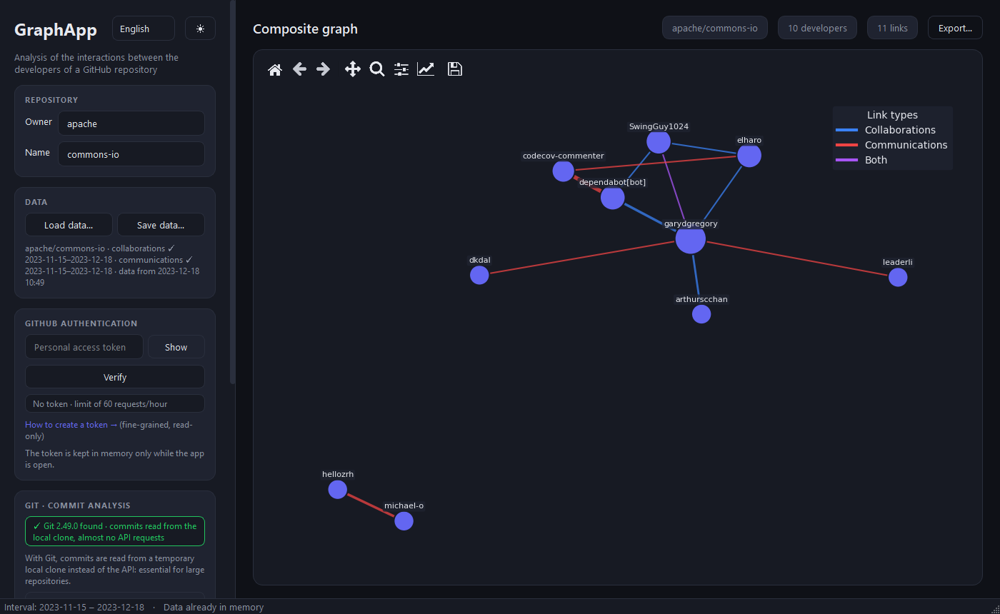
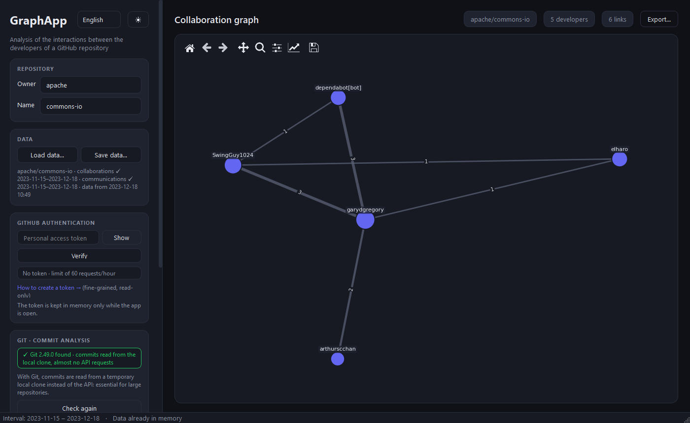
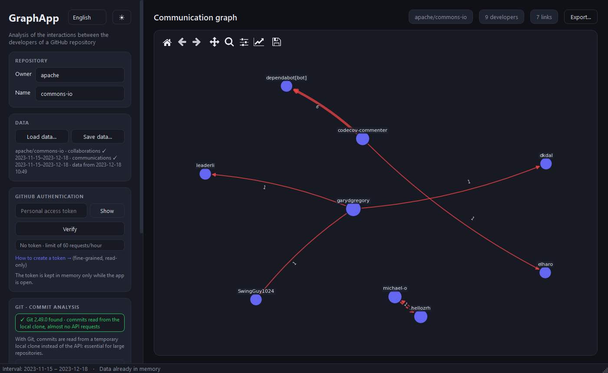
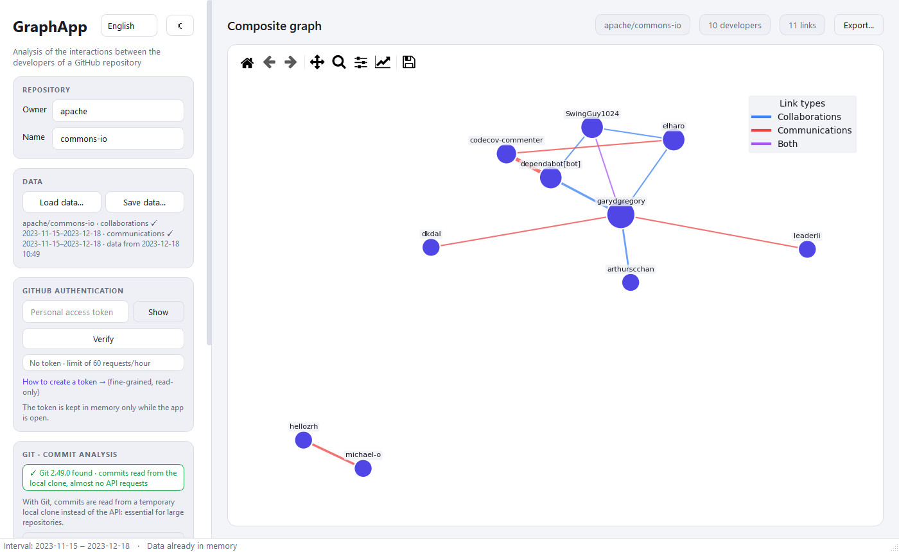
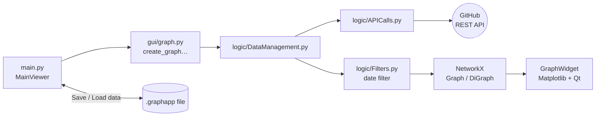

# GraphApp — Collaboration Graph Project

🇬🇧 **English** · 🇮🇹 [Italiano](README.it.md)

[](https://github.com/gPiscopo3/Ingegneria-del-Software-2023/actions/workflows/python-app.yml)


[](LICENSE)

**GraphApp** is a desktop application that analyzes a GitHub repository and shows, as a graph,
**how its developers collaborate and communicate** over a time interval chosen by the user.

Just enter the owner and name of the repository: the app downloads commits, issues, pull requests, reviews
and comments through the GitHub REST API and builds the graph with [NetworkX](https://networkx.org/),
drawing it with [Matplotlib](https://matplotlib.org/) inside a
[PyQt6](https://www.riverbankcomputing.com/software/pyqt/) interface.

> Project developed for the **Software Engineering** course (Università degli Studi del Sannio, academic year 2023) and later improved with Claude Code.



---

## Contents

- [Features](#features)
- [The three graph types](#the-three-graph-types)
- [Screenshots](#screenshots)
- [Download the app (Windows)](#download-the-app-windows)
- [Install from source](#install-from-source)
- [GitHub token](#github-token)
- [Running and usage](#running-and-usage)
  - [Exporting for analysis (R, MATLAB, Python)](#exporting-for-analysis-r-matlab-python)
- [Interface languages](#interface-languages)
- [Architecture](#architecture)
- [Saving data and rate limits](#saving-data-and-rate-limits)
  - [API quota usage](#api-quota-usage)
- [Tests and code quality](#tests-and-code-quality)
- [Known limitations](#known-limitations)
- [License](#license)

---

## Features

- **Three graph types**: collaborations, communications and composite (details [below](#the-three-graph-types)).
- **Time filter**: choose the interval (start and end date) to analyze; when it changes, the graph is
  recomputed on the data already downloaded, without new API calls.
- **Readable graph**: force-directed layout, node size proportional to the number of links, edge width
  proportional to the weight, labels with the number of interactions.
- **Smooth large graphs**: above 150 nodes the graph is drawn in a lighter style (labels only for the 40 most
  connected nodes, the name of any node on hover, directed edges without arrows above 300 links), so zooming
  and panning stay instant even with thousands of elements.
- **Exploration tools**: zoom and pan from the built-in toolbar, developer name on hover.
- **Export for analysis and publications**: graph and raw data as CSV, GraphML and MATLAB (.mat), plus an
  image of the graph as PNG (300 dpi), SVG or PDF with a light background suitable for printing.
- **Modern interface**: sidebar with the parameters, graph statistics (developers and links),
  **dark and light themes** switchable on the fly.
- **Multilingual interface**: Italian and English, chosen automatically from the Windows language and
  switchable on the fly; adding a language only takes a translation file ([details](#interface-languages)).
- **Token entered in the app**: the personal access token is pasted directly into the interface, verified
  with one click and kept only in memory; the remaining API quota is always visible.
- **Saving and loading data**: data downloaded from GitHub is saved to a `.graphapp` file chosen by the user
  and loaded later (even on another computer and without a token) to generate any graph without new API calls.
- **Reduced quota usage**: with [Git](https://git-scm.com/downloads) installed, commits are read from a
  temporary local clone (no API request per commit); comments and review comments are downloaded in bulk
  for the whole repository.
- **Parallel background download**: requests to GitHub run on several threads and the interface stays
  usable, with progress in the status bar and a cancel button.
- **Rate limit handling**: when a limit is reached (primary or secondary), the app waits for the reset and
  retries automatically.

## The three graph types

| Type | Graph | Nodes | An edge A — B means… | Edge weight |
|------|-------|-------|----------------------|-------------|
| **Collaborations** | undirected | developers who made commits | A and B modified the same file in the interval | number of files modified by both |
| **Communications** | directed (A → B) | users active in issues and pull requests | A replied (comment, review, commit in a PR) after a contribution by B in the same discussion | number of replies |
| **Composite** | undirected | union of the two | overlay of the two graphs, colored by type | — |

In the composite graph, edge colors show the type of relationship:

- 🔵 **blue**: collaboration only
- 🔴 **red**: communication only
- 🟣 **purple**: the two developers both collaborate and communicate

## Screenshots

| Collaborations | Communications |
|:-:|:-:|
|  |  |

| Composite, dark theme | Composite, light theme |
|:-:|:-:|
|  |  |

## Download the app (Windows)

No Python installation needed:

1. from the [Releases](https://github.com/gPiscopo3/Ingegneria-del-Software-2023/releases) page download
   `GraphApp-v….-windows.zip`;
2. extract the archive and open `GraphApp\GraphApp.exe`.

The executable is not digitally signed: on first launch Windows SmartScreen may show "Windows protected your
PC"; choose **More info → Run anyway**. Reading commits from the local clone still requires
**[Git](https://git-scm.com/downloads)** to be installed (the Git card in the app tells you).

## Install from source

Requirements: **Python 3.10 or later** and an Internet connection to download data from GitHub.
Recommended: **[Git](https://git-scm.com/downloads)** in the `PATH`, essential for large repositories
(see [API quota usage](#api-quota-usage)).

```bash
git clone https://github.com/gPiscopo3/Ingegneria-del-Software-2023.git
cd Ingegneria-del-Software-2023

# virtual environment (recommended)
python -m venv .venv
# Windows
.venv\Scripts\activate
# Linux / macOS
source .venv/bin/activate

pip install -r requirements.txt
```

## GitHub token

The GitHub API can be used without authentication, but with a limit of **60 requests per hour**, not enough
for almost any repository. With a personal token the limit rises to **5,000 requests per hour**.

1. Go to **GitHub → Settings → Developer settings → Personal access tokens → Fine-grained tokens**
   ([direct link](https://github.com/settings/personal-access-tokens/new)).
2. Create a **read-only** token: analyzing public repositories needs no extra permission (for private ones
   grant read access to *Contents*, *Issues* and *Pull requests*).
3. Copy the token, paste it into the **GitHub authentication** field of the app and press **Verify**.

The badge below the field shows the result:

| Badge | Meaning |
|-------|---------|
| ✓ Authenticated · 4,987/5,000 requests · resets at 16:27 | valid token, with the requests actually available and the time the quota is refilled |
| ✓ Authenticated · 0/5,000 requests · resets at 16:27 (red) | valid token but quota exhausted: downloads wait for the reset |
| ✕ Invalid or expired token | GitHub rejected the token: the app does not proceed |
| No token · 12/60 requests · resets at 16:27 | the API is used without authentication (the app asks for confirmation) |

> 🔒 **The token is never saved to disk**: it stays in memory only while the app is open.
> If you don't verify it manually, the app verifies it automatically before generating the graph.
> During a download the badge and the status bar are updated with every GitHub response.

## Running and usage

From the main project folder:

```bash
python -m src.main
```

1. Enter the **owner** and **name** of the repository (e.g. `apache` / `commons-io`).
2. Paste your **token** and press **Verify**.
3. Choose the **graph type**: a short description appears below the menu.
4. Set the **time interval** (from / to): by default the last 3 months, but any period can be chosen, past
   ones included. **Only the data of that interval is downloaded.**
5. Press **Generate graph**.

The download covers only the chosen interval: commits, issues, pull requests and comments created between
"From" and "To". The wider the interval, the more requests are needed: for large repositories start with a
short period (e.g. `tensorflow/tensorflow`, last week: ~550 requests, less than 3 minutes). The download runs
in the background: the status bar shows the progress (e.g. `apache/commons-io · Collaborations · Commits
340/1,200`) and the button becomes **Cancel download**; when cancelling, the parts already fully downloaded
(collaborations or communications) stay in memory and can be saved. While the app stays open:

- **narrowing** the interval or going back to a graph type already generated makes no new requests;
- **widening** it beyond the downloaded period starts a new download of the chosen interval, which replaces
  the data in memory (the status bar says so).

The **Data** card shows the downloaded period of each part, e.g.
`apache/commons-io · collaborations ✓ 2026-07-08–2026-10-08 · communications ✕`.

### Saving and loading data

In the **Data** card of the sidebar:

- **Save data…** saves the downloaded data of the repository to a `.graphapp` file (collaborations and/or
  communications, depending on the graphs generated). Below the buttons you can see what is in memory, for
  example `apache/commons-io · collaborations ✓ · communications ✕ · data from 2026-10-07 14:58`.
- **Load data…** opens a previously saved file: owner and repository name are filled in automatically and,
  if the file contains the data for the chosen graph type, the graph is generated right away. No token is
  needed; if part of the data is missing (e.g. only collaborations) and you choose a graph that needs it,
  that part is downloaded from GitHub.
- After loading, the calendar is **limited to the period covered by the file** (from the start date of the
  download to the save date) and selects all of it; below the dates you see the available period and the
  period with recorded activity, for example
  `Data available from 2023-11-15 to 2023-12-18 · activity recorded from 2023-11-16 to 2023-12-15`.
  Changing the owner or repository name restores the normal limits.

[`data/examples/`](data/examples) contains sample data for `apache/commons-io` and `tensorflow/tensorflow`,
to open with **Load data…** and try the app without a token. The status bar at the bottom shows the analyzed
interval and the remaining API quota.

The toolbar above the graph offers: reset view, zoom, pan and save as image. Hovering over a node shows the
developer's name and number of links.

With large graphs (e.g. the communications of `tensorflow/tensorflow`: 1,360 nodes and 4,158 edges) the
drawing is lighter: each zoom or pan takes ~0.07 s instead of ~2.4 s. The node layout is computed only once
(with fewer iterations for graphs above 300 nodes) and reused when the theme changes. At the top of the
sidebar, next to the title, there are the language selector and the ☀/☾ button that switches between the
dark and the light theme.

### Exporting for analysis (R, MATLAB, Python)

GraphApp is also meant to **extract data** for research tools. The **Export…** button above the graph exports
the graph shown (with the repository, type and interval it was generated with) and the raw data it comes
from. You choose the files, the folder and the name; by default `owner_repo_type_YYYYMMDD-YYYYMMDD`. If
**more than one format** is selected, all the files are collected in a **single `.zip` archive** (e.g.
`apache_commons-io_composite_20231115-20231218.zip`); with a single format you get the individual files (two
CSV files for "Nodes and edges"). The graph type in file names and metadata (`collaboration`,
`communication`, `composite`) and the edge and weight definitions are **always in English**, whatever the
interface language, so analysis scripts don't depend on the language of whoever exported the data. The title
and legend of the image follow the interface language.

| File | Content | Typical use |
|------|---------|-------------|
| `…_nodes.csv` | `id`, `name` (login), `github_id`, `degree`, `strength` (weighted degree), `in_degree`/`out_degree` if directed | node table |
| `…_edges.csv` | `source`, `target`, `weight`; in the composite graph also `weight_collaboration`, `weight_communication`, `type` (`collaboration`/`communication`/`both`) | edge table |
| `….graphml` | graph with the same attributes, plus repository, type, interval, edge and weight definitions and export date as graph attributes | igraph, NetworkX, Gephi, Cytoscape |
| `….mat` | `A` (weighted sparse adjacency matrix, symmetric if undirected), `names`, `github_ids`, `directed`, `source`/`target` (1-based indices), `weight`, struct `info`; in the composite graph also `A_collaboration` and `A_communication` | MATLAB |
| `…_edits.csv` | `developer`, `developer_id`, `file`, `timestamp`: one row per file edit | developer–file bipartite network, analysis over time |
| `…_interactions.csv` | `source`, `source_id`, `target`, `target_id`, `timestamp`: one row per reply | temporal communication networks |
| `….png` / `….svg` / `….pdf` | image of the graph with the same node layout shown in the app and a title with repository, type and interval; PNG at 300 dpi, vector SVG and PDF; light background ("Light background (for printing)" option, on by default) or dark | papers, theses, slides |

The image is not selected by default: choose it with the **Graph image** checkbox, together with the format.
Dates are in UTC (ISO 8601), CSV files in UTF-8 with a header. Definitions:

- **collaborations** (`collaboration`): undirected edge between two developers who modified at least one
  common file in the interval; weight = number of common files;
- **communications** (`communication`): directed edge `source → target` if `source` replied (comment, review,
  commit in a PR) after a contribution by `target` in the same issue or PR; weight = number of replies;
- **composite** (`composite`): union of the two, with separate weights (communications sum both directions).

The raw timestamped data (`edits`, `interactions`) matters because measures computed on a network aggregated
over time can be misleading and depend on the chosen window (Scholtes et al., *EPJ B* 2016): it lets you
redo the aggregation, use sliding windows or temporal network tools (networkDynamic/tsna in R, pathpy in
Python), or build the developer–file bipartite network.

Loading:

```r
# R (igraph)
library(igraph)
nodes <- read.csv("apache_commons-io_composite_20231115-20231218_nodes.csv")
edges <- read.csv("apache_commons-io_composite_20231115-20231218_edges.csv")
g <- graph_from_data_frame(edges[, c("source", "target", setdiff(names(edges), c("source", "target")))],
                           vertices = nodes[, c("name", setdiff(names(nodes), "name"))], directed = FALSE)
# or
g <- read_graph("apache_commons-io_composite_20231115-20231218.graphml", format = "graphml")
```

```matlab
% MATLAB
load("apache_commons-io_composite_20231115-20231218.mat")
G = graph(A, names);          % communications: G = digraph(A, names)
% or from the tables
T = readtable("apache_commons-io_composite_20231115-20231218_edges.csv", "TextType", "string");
G = graph(table([T.source T.target], T.weight, 'VariableNames', {'EndNodes', 'Weight'}));
```

```python
# Python (NetworkX)
import networkx as nx
g = nx.read_graphml("apache_commons-io_composite_20231115-20231218.graphml")
```

## Interface languages

The interface is available in **Italian** and **English**. At startup it follows the Windows language (English
if that language is not translated); the selector at the top of the sidebar changes it on the fly, keeping
repository, token, interval and the graph shown. The choice is not saved: the app never writes to disk on its
own.

Each language is a JSON file in [`src/locales/`](src/locales):

```json
{
  "meta": {"name": "English", "date_format": "%Y-%m-%d", "qt_date_format": "yyyy-MM-dd",
           "time_format": "%H:%M", "thousands_separator": ","},
  "messages": {"action.generate": "Generate graph", "graph.developers": "{count} developers", "…": "…"}
}
```

### Adding a language

No code is needed:

1. copy `src/locales/en.json` to `src/locales/<code>.json` (e.g. `de.json`, with the ISO 639-1 code);
2. translate `meta.name` (the language's own name, e.g. `Deutsch`), the date and time formats
   ([`strftime`](https://docs.python.org/3/library/datetime.html#strftime-and-strptime-format-codes) and
   [Qt](https://doc.qt.io/qt-6/qdate.html#toString)) and all the texts in `messages`, leaving the placeholders
   in braces (`{count}`, `{repo}`, …) unchanged;
3. run `pytest test`: the tests check every language file present (same keys as English, same
   placeholders, valid formats).

The new language appears in the selector, is chosen automatically on systems in that language and is included
in the executable (the `.spec` bundles the whole `src/locales` folder). Qt's standard buttons (Yes/No, file
dialogs) use Qt's own translations, when available for that language.

## Architecture

```
src/
├── main.py                  # main window (MainViewer): sidebar, graph area, event handling
├── i18n.py                  # translations: available languages, texts (tr), date and number formats
├── locales/                 # one JSON file per language (it.json, en.json, …)
├── gui/
│   ├── export_dialog.py     # "Export…" dialog: choice of files, folder and name
│   ├── graph.py             # NetworkX graph construction, drawing, GraphWidget (Matplotlib in Qt) and image
│   ├── style.py             # dark/light themes: QSS stylesheet, QPalette and graph colors
│   ├── widget_calendar.py   # time interval selector
│   └── worker.py            # DownloadWorker: download in a QThread, with progress and cancellation
├── logic/
│   ├── APICalls.py          # parallel GitHub REST API calls, pagination, rate limits
│   ├── DataManagement.py    # users/files built from raw data, saving/loading (.graphapp)
│   ├── Export.py            # export to CSV, GraphML, MATLAB (.mat), timestamped raw data, image and zip
│   ├── GitHistory.py        # commits from a partial local git clone (no API quota), commit authors
│   └── Filters.py           # filtering of collaborations and communications by date range
└── model/
    ├── User.py              # user and their communications (date → recipients)
    └── File.py              # file and its edits (date → author)
data/examples/               # sample data to open with "Load data…"
test/                        # pytest tests of logic, model, graph drawing, translations and main window
graphapp.py, graphapp.spec   # entry point and PyInstaller configuration of the Windows executable
```

Data flow when **Generate graph** is pressed:



### "Git · commit analysis" card

In the sidebar, below authentication, a card shows whether Git is available:

| Badge | Meaning |
|-------|---------|
| ✓ Git 2.49.0 found · commits read from the local clone, almost no API requests | commits are read from the local clone |
| ✕ Git not found · each commit costs 1 API request | commits are downloaded through the API; the **Download Git →** link appears |

After installing Git just press **Check again**, without restarting the app. If Git is missing and you
generate a graph that needs collaborations, the app warns about the higher quota usage and asks for
confirmation.

### GitHub endpoints used

All requests use version **`2026-03-10`** of the REST API (`X-GitHub-Api-Version` header); reviews and
commits of the pull requests also use the GraphQL API.

| Data | Endpoint |
|------|----------|
| Commits and modified files (with Git) | clone `https://github.com/{owner}/{repo}.git`: no API quota |
| Commit authors (with Git) | `GET /repos/{owner}/{repo}/commits?since={date}` (100 per request, stopped as soon as all authors are known) and `GET /repos/{owner}/{repo}/commits/{sha}` for a single commit of each author still unknown |
| Commits and modified files (without Git) | `GET /repos/{owner}/{repo}/branches`, `/commits?sha={sha}&since={date}`, `/commits/{sha}` for each commit |
| Issues and pull requests active in the period | `GET /repos/{owner}/{repo}/issues?state=all&since={date}` (one list, split into issues and PRs) |
| Issue and PR comments (in bulk) | `GET /repos/{owner}/{repo}/issues/comments?since={date}` |
| Review comments (in bulk) | `GET /repos/{owner}/{repo}/pulls/comments?since={date}` |
| Reviews and commits of the PRs (with a token) | `POST /graphql`: one query every 50 PRs |
| Reviews and commits of a PR (without a token, or if GraphQL fails) | `GET /repos/{owner}/{repo}/pulls/{n}/reviews`, `/pulls/{n}/commits` |
| Token verification and quota | `GET /user` with a token (1 request; the quota is read from the `X-RateLimit-*` headers, because with some tokens `/rate_limit` always reports a full quota), `GET /rate_limit` without a token |

## Saving data and rate limits

- **No implicit cache**: the app never writes to disk on its own. Downloaded data stays in memory while the
  app is open; use **Save data…** to keep it.
- **`.graphapp` file format**: a single file per repository with owner and name, data start date, save date,
  modified files with their edits (collaborations) and users with their communications. One of the two parts
  may be missing if the corresponding graph was not generated.
- **Safe loading**: the file is a Python pickle, but it is read with a restricted unpickler that only accepts
  the model classes (`User`, `File`) and dates: a tampered file cannot run code.
- **Parallel requests**: commit, pull request and issue details are downloaded by 8 threads, each with its own
  HTTP session (connections are reused). A commit present in several branches is downloaded only once.
  Requests are spaced to at most 12 per second, below GitHub's secondary limit (~900 per minute).
- **Rate limits**: if GitHub answers `403`/`429` because a limit was reached, the app waits for the indicated
  time (`Retry-After` for secondary limits, `X-RateLimit-Reset` for the hourly one) and retries; while waiting
  all threads pause and the status bar shows when the download resumes. The wait can be interrupted with
  **Cancel download**. Always use a token for large repositories.

### API quota usage

With a token the limit is 5,000 requests per hour. To make the quota last on large repositories too:

- **Commits from the local clone**: with Git the app makes a partial clone in a temporary folder
  (`git clone --bare --no-single-branch --filter=blob:none --shallow-since=…`: all branches, only commits and
  file trees, no contents, only from the month before the start date) and reads the modified files with
  `git log --name-only`. The clone uses no API quota and the folder is deleted at the end (even if the
  download is cancelled). The API is only needed to map author emails to GitHub accounts:
  `id+login@users.noreply.github.com` emails cost nothing, the others are resolved with the commit list (100
  per request) and, for the remaining authors, with a single commit each. If the clone fails (no git,
  network, private repository without permissions) the app uses the API.
- **Comments in bulk**: issue and PR comments and review comments are downloaded for the whole repository,
  100 per request, instead of issue by issue and PR by PR.
- **Reviews and commits with GraphQL**: there is no repository-level REST endpoint for them (2 requests per
  PR), so with a token they are requested 50 PRs at a time with the GraphQL API, which has its own quota,
  separate from the REST one. `microsoft/vscode`, 3 months (~7,400 PRs): ~150 queries instead of ~14,800
  requests. Without a token (GraphQL requires one), or for a PR with more than 100 reviews or commits, the
  REST endpoints are used.

| Data | Before | Now |
|------|--------|-----|
| Commits | 1 request per commit + pages of each branch | ~0 (clone) + 1 request every 100 commits for the authors, only while needed |
| Pull requests | 4 requests per PR | 1 GraphQL query every 50 PRs + comments in bulk (2 requests per PR without a token) |
| Issues | 1 request per issue | comments in bulk (100 per request) |

Measured examples: the commits of `apache/commons-io` over the last 3 months cost **1 request instead of
107** (identical result); the communications of the same period **46 instead of 86**.

The main lever is still **the interval**: only the chosen period ("From"–"To") is downloaded. For a past
period, date-sorted lists (issues, comments) stop as soon as they pass "To", PRs created after "To" cost no
extra requests and commits are filtered with `--until`. Transient network errors (timeouts, dropped
connections) are retried automatically.

## Tests and code quality

```bash
pip install -r requirements-dev.txt      # app dependencies plus pytest, pytest-cov and pylint

# tests that call the API read the token from the GH_TOKEN environment variable
# (only for the tests: the application does not use it)
export GH_TOKEN=<your token>             # PowerShell: $env:GH_TOKEN="<your token>"

pytest test                              # run the tests
pytest --cov=src --cov-report html test  # with a coverage report in htmlcov/

pylint --disable line-too-long --disable wrong-import-order --disable no-name-in-module ./src
```

The **GitHub Actions** pipeline ([`python-app.yml`](.github/workflows/python-app.yml)) runs tests, coverage and
pylint static analysis on every push (Python 3.11 on Ubuntu).

### Executable and release

```bash
pip install pyinstaller==6.22.3
pyinstaller graphapp.spec --noconfirm    # -> dist/GraphApp/GraphApp.exe
```

Pushing a `v*` tag (e.g. `git tag v1.0.0 && git push origin v1.0.0`) runs the
[`release.yml`](.github/workflows/release.yml) workflow, which builds the executable on Windows and creates the
GitHub Release with the zip attached and the notes from the [CHANGELOG](CHANGELOG.md).

## Known limitations

- Without a token each pull request costs 2 API requests (reviews and commits): for repositories with many
  PRs an interval of many months exceeds the hourly quota. Without Git each commit also costs 1 request.
- GitHub cannot filter issues and PRs by end date: for a past period the pages of more recent ones are
  not requested (they are sorted by creation), but all those created before "To" and updated after
  "From" are.
- Cloning very large repositories requires temporary disk space and preparation time on GitHub's side.
- A `.graphapp` file is a snapshot of the data at download time: to update it, generate the graph without
  loading the file (after reopening the app) and save it again.
- Deleted GitHub accounts (`null` author) are ignored.

## License

Released under the **Apache 2.0** license: see the [LICENSE](LICENSE) file.

Authors: see the [project contributors](https://github.com/gPiscopo3/Ingegneria-del-Software-2023/graphs/contributors).
