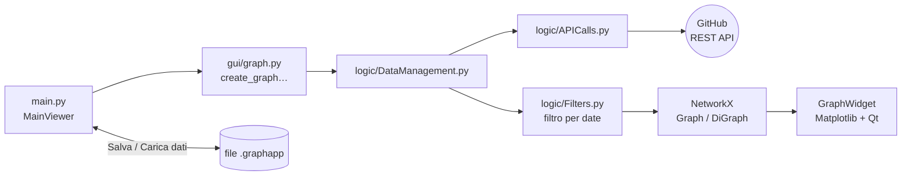

# GraphApp — Collaboration Graph Project

[](https://github.com/gPiscopo3/Ingegneria-del-Software-2023/actions/workflows/python-app.yml)


[](LICENSE)

**GraphApp** è un'applicazione desktop che analizza un repository GitHub e mostra, sotto forma di grafo,
**come collaborano e comunicano i suoi sviluppatori** in un intervallo di tempo scelto dall'utente.

Basta inserire owner e nome del repository: l'app scarica commit, issue, pull request, review e commenti
tramite le API REST di GitHub e costruisce il grafo con
[NetworkX](https://networkx.org/), visualizzandolo con [Matplotlib](https://matplotlib.org/) dentro
un'interfaccia [PyQt6](https://www.riverbankcomputing.com/software/pyqt/).

> Progetto realizzato per il corso di **Ingegneria del Software** (A.A. 2023).


---

## Indice

- [Funzionalità](#funzionalità)
- [I tre tipi di grafo](#i-tre-tipi-di-grafo)
- [Screenshot](#screenshot)
- [Installazione](#installazione)
- [Token GitHub](#token-github)
- [Avvio e utilizzo](#avvio-e-utilizzo)
- [Architettura](#architettura)
- [Salvataggio dei dati e rate limit](#salvataggio-dei-dati-e-rate-limit)
- [Test e qualità del codice](#test-e-qualità-del-codice)
- [Limiti noti](#limiti-noti)
- [Licenza](#licenza)

---

## Funzionalità

- **Tre tipi di grafo**: collaborazioni, comunicazioni e composito (dettagli [qui sotto](#i-tre-tipi-di-grafo)).
- **Filtro temporale**: si sceglie l'intervallo (data di inizio e di fine) da analizzare; cambiandolo,
  il grafo si ricalcola sui dati già scaricati, senza nuove chiamate alle API.
- **Grafo leggibile**: layout force-directed, dimensione dei nodi proporzionale al numero di collegamenti,
  spessore degli archi proporzionale al peso, etichette con il numero di interazioni.
- **Strumenti di esplorazione**: zoom, spostamento e salvataggio del grafo come immagine (PNG, SVG, PDF)
  dalla toolbar integrata.
- **Interfaccia moderna**: sidebar con i parametri, statistiche del grafo (sviluppatori e collegamenti),
  **tema scuro e chiaro** commutabili al volo.
- **Token inserito nell'app**: il personal access token si incolla direttamente nell'interfaccia, si
  verifica con un click e resta solo in memoria; la quota di richieste API residua è sempre visibile.
- **Salvataggio e caricamento dei dati**: i dati scaricati da GitHub si salvano in un file `.graphapp`
  scelto dall'utente e si ricaricano in seguito (anche su un altro computer e senza token) per generare
  qualsiasi grafo senza nuove chiamate alle API.
- **Download parallelo e in background**: le richieste a GitHub partono su più thread e l'interfaccia
  resta utilizzabile, con l'avanzamento nella barra di stato e un pulsante per annullare.
- **Gestione del rate limit**: in caso di limite raggiunto (primario o secondario) l'app attende il reset
  e riprova automaticamente.

## I tre tipi di grafo

| Tipo | Grafo | Nodi | Un arco A — B significa… | Peso dell'arco |
|------|-------|------|--------------------------|----------------|
| **Collaborazioni** | non diretto | sviluppatori che hanno fatto commit | A e B hanno modificato lo stesso file nell'intervallo | numero di file modificati da entrambi |
| **Comunicazioni** | diretto (A → B) | utenti attivi in issue e pull request | A ha risposto (commento, review, commit in PR) dopo un intervento di B nella stessa discussione | numero di risposte |
| **Composito** | non diretto | unione dei due | sovrapposizione dei due grafi, colorata per tipo | — |

Nel grafo composito i colori degli archi indicano il tipo di relazione:

- 🔵 **blu**: solo collaborazione
- 🔴 **rosso**: solo comunicazione
- 🟣 **viola**: la coppia di sviluppatori sia collabora sia comunica

## Screenshot

| Collaborazioni | Comunicazioni |
|:-:|:-:|
|  |  |

| Composito, tema scuro | Composito, tema chiaro |
|:-:|:-:|
|  |  |

## Installazione

Requisiti: **Python 3.9 o superiore** e una connessione a Internet per scaricare i dati da GitHub.

```bash
git clone https://github.com/gPiscopo3/Ingegneria-del-Software-2023.git
cd Ingegneria-del-Software-2023

# ambiente virtuale (consigliato)
python -m venv .venv
# Windows
.venv\Scripts\activate
# Linux / macOS
source .venv/bin/activate

pip install -r requirements.txt
```

## Token GitHub

Le API di GitHub si possono usare anche senza autenticazione, ma con un limite di **60 richieste
all'ora**, insufficiente per quasi tutti i repository. Con un token personale il limite sale a
**5.000 richieste all'ora**.

1. Vai su **GitHub → Settings → Developer settings → Personal access tokens → Fine-grained tokens**
   ([link diretto](https://github.com/settings/personal-access-tokens/new)).
2. Crea un token con accesso in **sola lettura**: per analizzare repository pubblici non serve
   nessun permesso aggiuntivo (per quelli privati concedi la lettura di *Contents*, *Issues* e *Pull requests*).
3. Copia il token e incollalo nel campo **Autenticazione GitHub** dell'app, poi premi **Verifica**.

Il badge sotto il campo mostra l'esito:

| Badge | Significato |
|-------|-------------|
| ✓ Autenticato · 4.987/5.000 richieste · rinnovo alle 16:27 | token valido, con le richieste effettivamente disponibili e l'ora in cui la quota torna piena |
| ✓ Autenticato · 0/5.000 richieste · rinnovo alle 16:27 (rosso) | token valido ma quota esaurita: i download attendono il rinnovo |
| ✕ Token non valido o scaduto | GitHub ha rifiutato il token: l'app non procede |
| Nessun token · 12/60 richieste · rinnovo alle 16:27 | si usano le API senza autenticazione (l'app chiede conferma) |

> 🔒 **Il token non viene mai salvato su disco**: resta in memoria solo finché l'app è aperta.
> Se non lo verifichi a mano, l'app lo verifica automaticamente prima di generare il grafo.
> Durante un download il badge e la barra di stato si aggiornano a ogni risposta di GitHub.

## Avvio e utilizzo

Dalla cartella principale del progetto:

```bash
python -m src.main
```

1. Inserisci **owner** e **nome** del repository (es. `apache` / `commons-io`).
2. Incolla il tuo **token** e premi **Verifica**.
3. Scegli il **tipo di grafo**: sotto il menu compare una breve descrizione.
4. Imposta l'**intervallo temporale** (dal / al).
5. Premi **Genera grafo**.

Il primo caricamento di un repository può richiedere tempo (vengono scaricati tutti i commit di tutti i
branch, le issue e le pull request con i relativi commenti). Il download avviene in background: la barra
di stato mostra l'avanzamento (es. `apache/commons-io · Collaborazioni · Commit 340/1.200`) e il pulsante
diventa **Annulla download**; annullando, le parti già scaricate per intero (collaborazioni o
comunicazioni) restano in memoria e si possono salvare. Finché l'app resta aperta, cambiando solo
l'intervallo o tornando a un tipo di grafo già generato non viene fatta alcuna nuova richiesta.

### Salvare e ricaricare i dati

Nella card **Dati** della sidebar:

- **Salva dati…** salva in un file `.graphapp` i dati già scaricati del repository indicato
  (collaborazioni e/o comunicazioni, a seconda dei grafi generati). Sotto i pulsanti è indicato cosa è
  in memoria, ad esempio `apache/commons-io · collaborazioni ✓ · comunicazioni ✕ · dati del 07/10/2026 14:58`.
- **Carica dati…** apre un file salvato in precedenza: owner e nome del repository vengono compilati da
  soli e, se il file contiene i dati per il tipo di grafo scelto, il grafo viene generato subito.
  Non serve il token; se manca una parte dei dati (es. solo collaborazioni) e si sceglie un grafo che la
  richiede, quella parte viene scaricata da GitHub.
- Dopo il caricamento il calendario si **limita al periodo coperto dal file** (dalla data di inizio del
  download alla data di salvataggio) e lo seleziona per intero; sotto le date compare il periodo
  disponibile e quello in cui c'è attività registrata, ad esempio
  `Dati disponibili dal 15/11/2023 al 18/12/2023 · attività registrata dal 16/11/2023 al 15/12/2023`.
  Cambiando owner o nome del repository il calendario torna ai limiti normali.

In [`data/examples/`](data/examples) ci sono i dati di esempio di `apache/commons-io` e
`tensorflow/tensorflow`, da aprire con **Carica dati…** per provare l'app senza token.
La barra di stato in basso mostra l'intervallo analizzato e la quota API residua.

Nella toolbar sopra il grafo trovi: ripristino della vista, zoom, spostamento e salvataggio come
immagine. Il pulsante in fondo alla sidebar passa dal tema scuro a quello chiaro.

## Architettura

```
src/
├── main.py                  # finestra principale (MainViewer): sidebar, area del grafo, gestione eventi
├── gui/
│   ├── graph.py             # costruzione dei grafi NetworkX e GraphWidget (Matplotlib in Qt)
│   ├── style.py             # temi scuro/chiaro: foglio di stile QSS, QPalette e colori dei grafi
│   ├── widget_calendar.py   # selettore dell'intervallo temporale
│   └── worker.py            # DownloadWorker: download in un QThread, con avanzamento e annullamento
├── logic/
│   ├── APICalls.py          # chiamate alle API REST di GitHub in parallelo, paginazione, rate limit
│   ├── DataManagement.py    # costruzione di utenti/file dai dati grezzi, salvataggio/caricamento (.graphapp)
│   └── Filters.py           # filtro di collaborazioni e comunicazioni per intervallo di date
└── model/
    ├── User.py              # utente e relative comunicazioni (data → destinatari)
    └── File.py              # file e relative modifiche (data → autore)
data/examples/               # dati di esempio caricabili con «Carica dati…»
test/                        # test pytest di logic e model
```

Flusso dei dati alla pressione di **Genera grafo**:



### Endpoint GitHub utilizzati

Tutte le richieste usano la versione **`2026-03-10`** delle API REST (header `X-GitHub-Api-Version`).

| Dato | Endpoint |
|------|----------|
| Branch | `GET /repos/{owner}/{repo}/branches` |
| Commit di ogni branch | `GET /repos/{owner}/{repo}/commits?sha={sha}&since={data}` |
| File modificati da un commit | `GET /repos/{owner}/{repo}/commits/{sha}` |
| Issue | `GET /repos/{owner}/{repo}/issues?state=all&since={data}` |
| Commenti di una issue / PR | `GET /repos/{owner}/{repo}/issues/{n}/comments` |
| Pull request | `GET /repos/{owner}/{repo}/pulls?state=all` |
| Review, commenti di review, commit di una PR | `GET /repos/{owner}/{repo}/pulls/{n}/reviews`, `/comments`, `/commits` |
| Verifica del token e quota | `GET /user` con token (1 richiesta; la quota si legge dagli header `X-RateLimit-*`, perché con alcuni token `/rate_limit` riporta sempre la quota piena), `GET /rate_limit` senza token |

## Salvataggio dei dati e rate limit

- **Nessuna cache implicita**: l'app non scrive nulla su disco da sola. I dati scaricati restano in
  memoria finché l'app è aperta; per conservarli si usa **Salva dati…**.
- **Formato del file `.graphapp`**: un unico file per repository con owner e nome, data di inizio dei
  dati, data di salvataggio, file modificati con le relative modifiche (collaborazioni) e utenti con le
  relative comunicazioni. Una delle due parti può mancare se il grafo corrispondente non è stato generato.
- **Caricamento sicuro**: il file è un pickle Python, ma viene letto con un unpickler ristretto che
  accetta solo le classi del modello (`User`, `File`) e le date: un file manomesso non può eseguire codice.
- **Richieste parallele**: i dettagli di commit, pull request e issue vengono scaricati da 8 thread, ognuno
  con una propria sessione HTTP (connessioni riutilizzate). Un commit presente in più branch viene
  scaricato una sola volta. Le richieste sono distanziate a un massimo di 12 al secondo, sotto il limite
  secondario di GitHub (~900 al minuto).
- **Rate limit**: se GitHub risponde `403`/`429` per limite raggiunto, l'app attende il tempo indicato
  (`Retry-After` per i limiti secondari, `X-RateLimit-Reset` per quello orario) e riprova; durante
  l'attesa tutti i thread restano in pausa e la barra di stato mostra l'orario di ripresa. L'attesa si
  può interrompere con **Annulla download**. Per i repository grandi usa sempre un token.

## Test e qualità del codice

```bash
# i test che chiamano le API leggono il token dalla variabile d'ambiente GH_TOKEN
# (solo per i test: l'applicazione non la usa)
export GH_TOKEN=<il tuo token>          # PowerShell: $env:GH_TOKEN="<il tuo token>"

pytest test                              # esecuzione dei test
pytest --cov=src --cov-report html test  # con report di copertura in htmlcov/

pylint --disable line-too-long --disable wrong-import-order --disable no-name-in-module ./src
```

La pipeline di **GitHub Actions** ([`python-app.yml`](.github/workflows/python-app.yml)) esegue test,
copertura e analisi statica con pylint a ogni push.

## Limiti noti

- Il caricamento iniziale richiede una chiamata API per ogni commit: oltre le 5.000 richieste (limite
  orario con token) il download deve attendere il reset del limite, anche con le richieste in parallelo.
- Un file `.graphapp` è una fotografia dei dati al momento del download: per aggiornarli basta generare
  il grafo senza caricare il file (riaprendo l'app) e salvarli di nuovo.
- I dati vengono scaricati a partire dal 15/11/2023, data minima selezionabile nel calendario.
- Gli account GitHub eliminati (autore `null`) vengono ignorati.

## Licenza

Distribuito con licenza **Apache 2.0**: vedi il file [LICENSE](LICENSE).

Autori: vedi i [contributor del progetto](https://github.com/gPiscopo3/Ingegneria-del-Software-2023/graphs/contributors).
